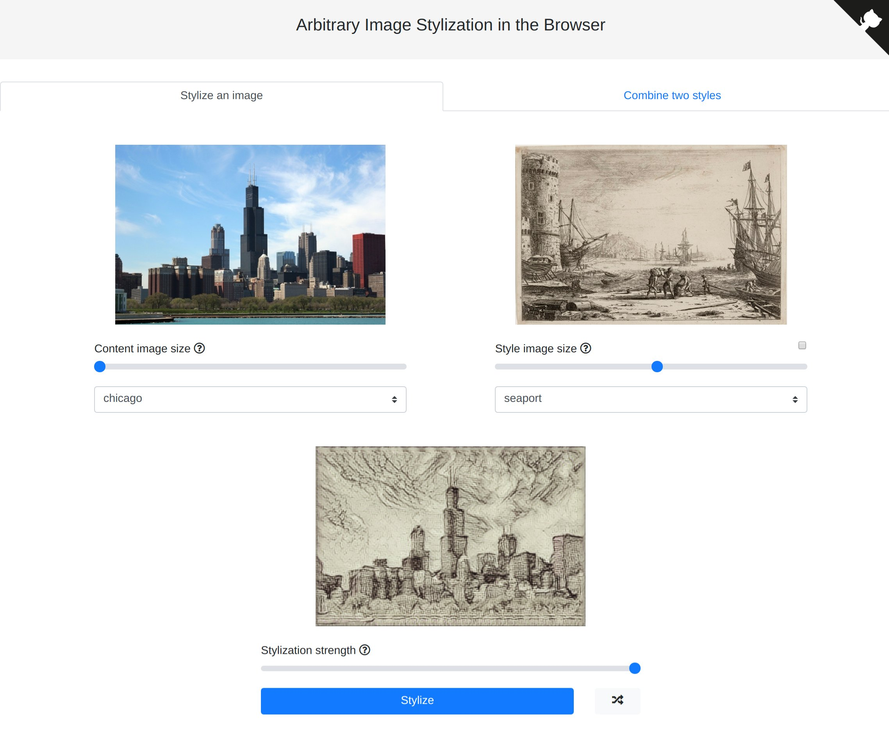
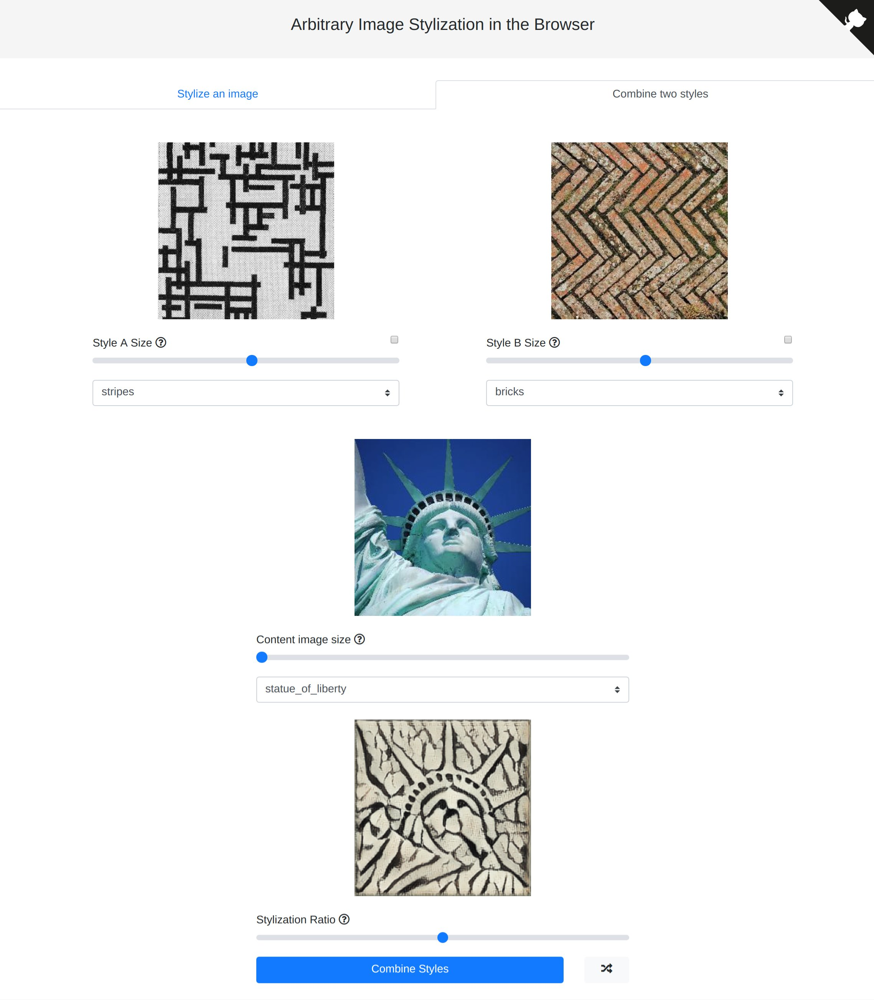

# 基于TensorFlow.js的画风迁移

本项目是基于[TensorFlow.js](https://js.tensorflow.org/)的纯览器端画风迁移算法实现。

Demo地址：https://reiinakano.github.io/arbitrary-image-stylization-tfjs

### 单风格迁移



### 多风格迁移



## 常见问题

### 概述

这是一个基于TensorFlow.js完全运行在浏览器端的画风迁移算法实现。跟所有基于神经网络的画风迁移算法一样，神经网络试图去“画”一张画，画的内容源自一张图（通常是一张照片），画的风格源自另一张图（通常是一幅画）。

虽然也有其他[浏览器端画风迁移实现](https://github.com/reiinakano/fast-style-transfer-deeplearnjs)，但它们往往受限于少量预置画风，因为每种画风都需要提前训练好一个与之对应的神经网络模型。

本项目通过一个将*任意*画风表示为100维向量的*画风网络*来突破这个限制，该向量跟照片内容一起注入*迁移网络*，产生最终的画风图像。

### 我的数据安全吗？你能看到我的图片吗？

您的数据和照片从未离开您的电脑！事实上，这是在浏览器端运行神经网络的主要优点之一。不是将您的数据发送给我们，而是我们将模型和运行模型的代码发送给您的浏览器，并由它来执行。

### 这些模型间有哪些不同？

原论文采用Inception-v3模型作为画风网络，该模型固化并发送至浏览器时体积达36.3MB。

为减小模型体积，我们将训练好的Inception-v3模型浓缩为MobileNet-v2模型，在模型质量略有牺牲的情况下，模型体积从36.3MB降到了9.6MB，减小了近四倍。

对于迁移网络，原论文采用基于普通卷积层的模型。该模型发送至浏览器时体积为7.9MB，且画风渲染运算中占很大比重。

为使迁移网络更高效，绝大多数的普通卷积层被深度可分离卷积层代替。这使得模型体积降至2.4MB，同时大幅提升了画风渲染速度。

本demo使用组合模型，默认使用的是MobileNet-v2画风网络和可分离卷积迁移网络。

### 下载的模型有多大？

压缩后的画风网络模型是9.6MB，可分离卷积迁移网络是2.4MB，总共是12MB。您只需要一次性下载这两模型，即可用于任意画风渲染。

### 画风组合是怎么实现的？

由于每种画风可通过画风网络转化为一个100维的画风向量，我们简单求两个画风向量的加权平均值，即可得到一个新的画风向量供迁移网络使用。

这也是我们能够控制画风渲染强度的原因，我们求画风图像向量和内容图像向量的加权平均值，并把结果作为迁移网络的输入。

## 本地开发调试

本项目采用[Yarn](https://yarnpkg.com/en/)为依赖管理工具

本地运行，您需要先安装Yarn，并在项目的根目录运行下面的命令来获得所有依赖包。

```bash
yarn run prep
```

然后，接着运行

```bash
yarn run start
```

在浏览器键入`localhost:9966`来访问本应用。

## 鸣谢

本demo的完成离不开他们：

* [arbitrary style transfer](https://arxiv.org/abs/1705.06830) 论文的作者
* [arbitrary style transfer](https://github.com/tensorflow/magenta/tree/master/magenta/models/arbitrary_image_stylization) 的代码库magenta
* [the MobileNet-v2 paper](https://arxiv.org/abs/1801.04381) 的作者
* 介绍[neural network knowledge distillation](https://arxiv.org/abs/1503.02531) 的论文作者
* [TensorFlow.js library](https://js.tensorflow.org)
* [Google Colaboratory](https://colab.research.google.com/)，有了它我才得使用免费GPU以做完所有必要的模型训练!

最后，我非常乐于结识有志于创造一套针对图片的，类似 [Magenta Studio](https://magenta.tensorflow.org/studio) 的艺术化渲染工具的同仁。如果您有想法或正在实施您的想法，一定要联系我哦！
